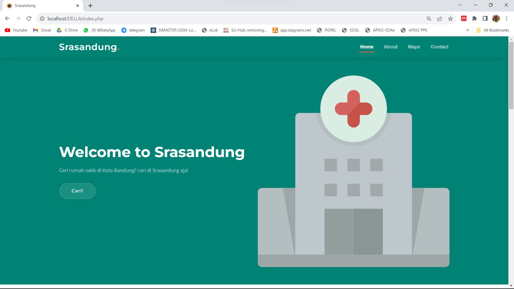
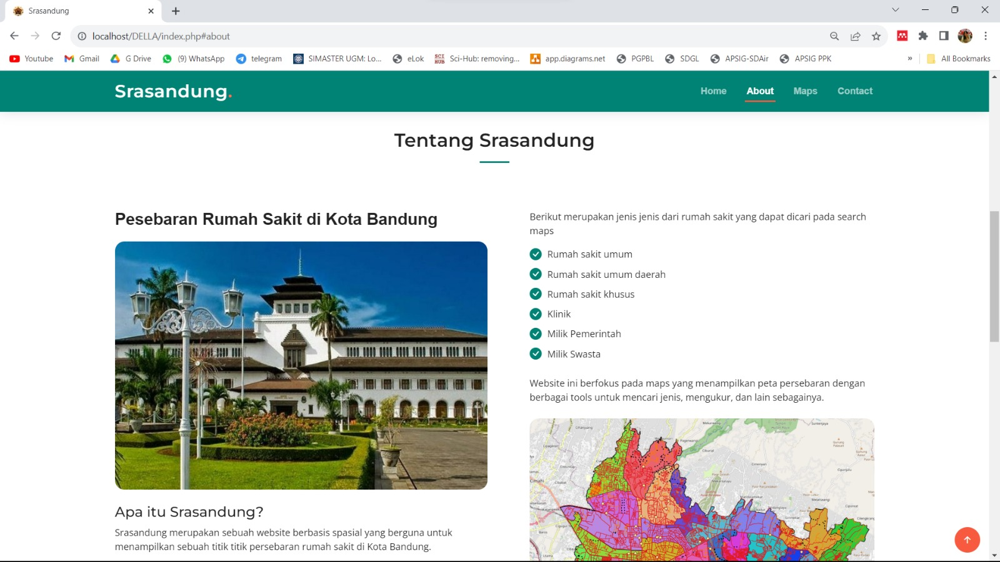
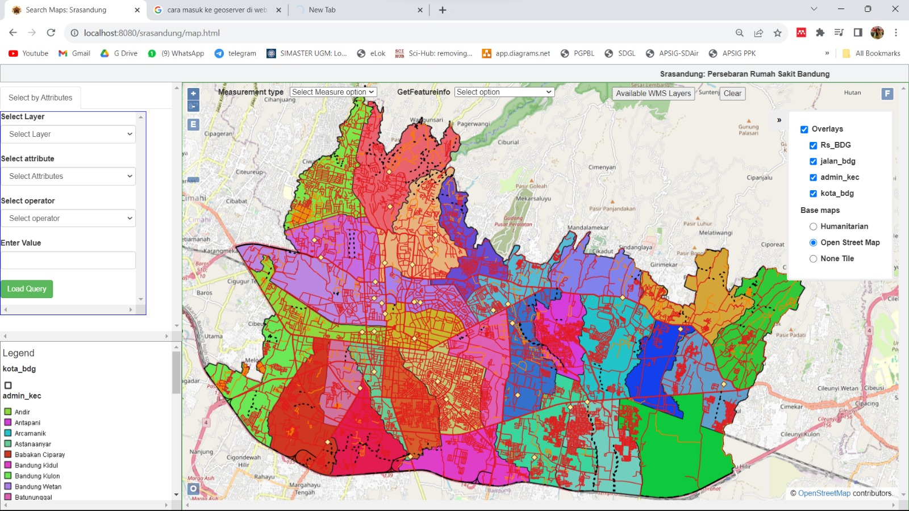

# WebGIS-srasandung
   WebGIS SRASANDUNG (Persebaran Rumah Sakit Bandung) ini berguna dalam mempermudah pencarian rumah sakit dengan jenisnya, ataupun mencari rumah sakit di beberapa Kecamatan di Kota Bandung. Harapan dibuatnya website ini adalah dapat membantu warga Bandung dan sekitarnya dalam mencari informasi rumah sakit yang terdaftar
   secara resmi di Kementrian Kesehatan.

# Stack
   1. Leaflet JS
   2. PHP
   3. QGIS
   4. Geoserver
   5. ArcGIS API

# Sumber Data
   Sumber data lokasi rumah sakit didapatkan dari open data jabar yang diakses melalui https://dashboard.jabarprov.go.id/id/topic/kesehatan/sebaran-rumah-sakit-jawa-barat 

# Komponen Produk

